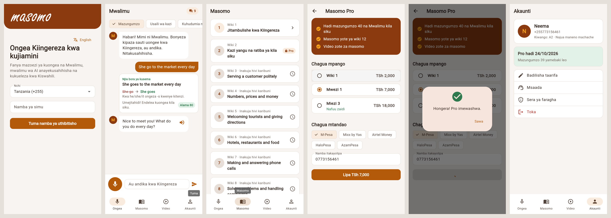

# Masomo Speak

An English speaking coach for phones. Learners talk to **Mwalimu**, an AI teacher who corrects their
English and explains each mistake in their own language (Swahili first). The app also has a
12-week "English for work" course, video lessons, and a Pro plan paid by M-Pesa, Mixx by Yas,
Airtel Money or HaloPesa (Tanzania) or Google Play (everywhere else).



*Screens from the automated browser test: sign-in, the tutor correcting "She go to the market", lessons, Pro plans, M-Pesa payment confirmed, and the account after going Pro.*

| Folder | What it is |
|---|---|
| `lib/` | The Flutter app (Android, iOS, web) |
| `jarvis/` | The server and the AI agents: tutor, lessons, marketing, support, reports ([README](jarvis/README.md)) |
| `docs/BUSINESS_PLAN.md` | Market research, pricing, and the plan to $1,000 a month |
| `test/`, `test_live/`, `jarvis/tests/` | App tests, live end-to-end test, server tests |

## Run it locally in 5 minutes (no API keys needed)

```bash
# 1. Server in demo mode: fake tutor replies, login codes shown in the API response
cd jarvis && python -m venv .venv && . .venv/bin/activate && pip install -r requirements.txt
JARVIS_ENV=dev JARVIS_LLM=demo JARVIS_SMS_PROVIDER=console JARVIS_DB=dev.db \
  JARVIS_CORS_ORIGINS=http://localhost:8080 uvicorn jarvis.server:app --port 8765

# 2. App (another terminal), pointing at that server
flutter pub get
flutter run -d chrome --web-port 8080 --dart-define=API_BASE_URL=http://localhost:8765
# On an Android emulator use http://10.0.2.2:8765 instead.
```

With a development server the login code is filled in for you. The demo tutor only knows a
few common mistakes (try "She go to work"); set `ANTHROPIC_API_KEY` and drop `JARVIS_LLM=demo`
for the real tutor.

## Tests

```bash
flutter analyze && flutter test          # 28 app tests: sign-in, tutor, lessons, quiz, payment, account, small screens
(cd jarvis && pytest -q)                 # 31 server tests, including concurrency and abuse cases
jarvis/devtools/e2e.sh                   # live server + mock AzamPay + the app's real HTTP client
E2E_UI=1 jarvis/devtools/e2e.sh          # also drives the web build in Chromium, with screenshots
```

`e2e.sh` needs Python with `jarvis/requirements.txt` installed. The browser step needs a web build
(`flutter build web --dart-define=API_BASE_URL=http://127.0.0.1:8765`) and Node with Playwright.

## Release build for Google Play

The app ID is `tz.co.masomo.app` and it targets Android API 36, which Google Play requires for new
apps and updates from 31 August 2026.

1. Create an upload key once and keep it safe. If you lose it, you can't update the app:
   `keytool -genkey -v -keystore ~/masomo-upload.jks -keyalg RSA -keysize 2048 -validity 10000 -alias upload`
2. Create `android/key.properties`. It's git-ignored, so never commit it:
   ```
   storePassword=...
   keyPassword=...
   keyAlias=upload
   storeFile=/home/you/masomo-upload.jks
   ```
3. Build: `flutter build appbundle --release --dart-define=API_BASE_URL=https://api.masomo.co.tz`
4. Upload `build/app/outputs/bundle/release/app-release.aab` to Play Console. Start with internal
   testing, then closed testing, then production.
5. In Play Console, create subscriptions with the product IDs `pro_monthly` and `pro_yearly`, and
   set regional prices for each.

If the old Masomo app is already on Google Play under a different package name, change
`applicationId` in `android/app/build.gradle.kts` to that name before the first upload. That way
the new app replaces the old listing and existing users get it as an update.

## What changed from the old app

The Flutter 1.x app no longer compiled and could not be published: its package name was
`com.example`, it targeted API 29, and it used removed APIs. It sent every user's phone number with
one shared password, and customers paid by sending money to personal numbers and pasting the SMS.
This version replaces it:

- **Login by SMS code**: a 6-digit code, used once, limited to 5 tries and 3 codes an hour.
- **Payments confirmed automatically** by a PIN prompt on the customer's phone.
- **An AI tutor instead of the Dialogflow chatbot.** Speech is turned into text and read aloud on
  the phone, so voice never leaves the device.
- The old code is still in git history (before commit `279757b`).
